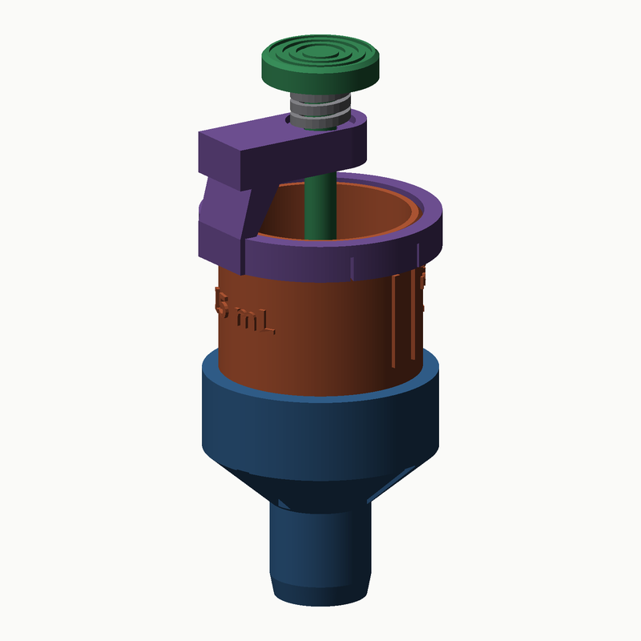
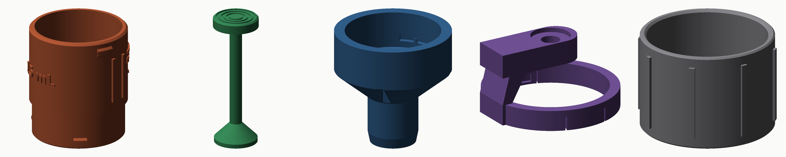

# Tabanı açılan ölçü kabı — 15 mL / 30 mL

Üstteki düğmeye basınca kabın altındaki **platform aşağı iner** ve sıvı, pet şişe
ağzına oturan borudan doğrudan şişeye boşalır. Düğmeyi bırakınca yay platformu
45°'lik konik koltuğa geri oturtur ve akış kesilir. Huni gerekmez, tek elle
kullanılır.



**Kesit çizimleri:** [15 mL](docs/kesit-15ml.svg) · [30 mL](docs/kesit-30ml.svg)
(kapalı ve açık konum yan yana)

---

## 1. Mekanizma

| | |
|---|---|
| **Valf tipi** | Merkezi pistonlu (poppet), 45° konik koltuk |
| **Koltuk** | Ø15 mm (üst) → Ø19 mm (alt), gövdeyle tek parça |
| **Platform** | Ø21 mm, 2 mm kılavuz bileziği ile merkezlenir |
| **Strok** | 5 mm (düğme stroku = platform stroku) |
| **Açıkken akış kesiti** | ~85 mm² → 30 mL yaklaşık 0,8 saniyede boşalır |
| **Kapatma kuvveti** | Yay ön gerilmesi 3 mm; sıvı basıncı platformu açma yönünde **itmez** |

Konik koltuk seçilmesinin sebebi: FDM'de iki düz yüzeyi sızdırmaz şekilde
eşleştirmek zordur, ama aynı açıdaki iki koni yay baskısı altında kendi kendini
merkezleyip tam çevre boyunca temas eder. Platform aşağıdan yukarı doğru
oturduğu için kabın içindeki sıvının ağırlığı da onu kapalı tutar.

---

## 2. Parçalar



| # | Dosya | Adet | Baskı yönü | Katı hacim |
|---|---|---|---|---|
| 1 | `stl/01-govde-15ml.stl` · `01-govde-30ml.stl` | 1 | **Ağız yukarı** | 17,9 / 22,0 cm³ |
| 2 | `stl/02-platform-mil-15ml.stl` · `-30ml.stl` | 1 | **Düğme tablada**, mil yukarı | 5,1 / 5,6 cm³ |
| 3 | `stl/03-bosaltma-agzi.stl` | 1 | **Boru yukarı** | 15,1 cm³ |
| 4 | `stl/04-kopru.stl` | 1 | **Bilezik tablada** | 6,7 cm³ |
| 5 | `stl/05-yay-baskili.stl` | 1 | Dik | 0,3 cm³ |
| 6 | `stl/06-altlik.stl` | 1 | Dik (opsiyonel) | 19,9 cm³ |

3, 4, 5 ve 6 numaralı parçalar **iki boy için ortaktır** — bir kez basmanız
yeter, gövde ve mili değiştirerek 15 ↔ 30 mL geçebilirsiniz.

Katı hacim = modelin gerçek hacmi. Gerçek filament tüketimi, önerilen ayarlarla
bunun kabaca yarısı kadardır (dilimleyici kesin değeri verir).

**Hiçbir parça destek istemez.** Tüm çıkıntılar 45°'den dik tutuldu.

---

## 3. Baskı ayarları (Bambu Lab X1C)

| Ayar | Değer | Neden |
|---|---|---|
| Malzeme | **PETG** (Bambu PETG HF / Basic) | Sıvıya ve ısıya PLA'dan dayanıklı, kırılgan değil |
| Nozul | 0,4 mm | — |
| Katman | **0,16 mm** (gövde, ağız) · 0,2 mm (diğerleri) | Koltuk yüzeyi ne kadar ince katmanlıysa o kadar sızdırmaz |
| Duvar sayısı | **5** | 5 × 0,42 mm = 2,1 mm = cidar kalınlığının tamamı → su geçirmez |
| Üst/alt katman | 5 / 5 | |
| Dolgu | %20 gyroid | |
| Destek | **Kapalı** | |
| Brim | **Açık, 5 mm** | Gövde ve mil ince tabanlı ve uzun |
| Kurutma | PETG'yi 65 °C'de 4 saat | Nem = pürüzlü koltuk yüzeyi = damlatma |

**Mil (parça 2)** ince ve uzun (Ø6 × 65–82 mm). Tek başına basarken yavaşlatın
(dış duvar ≤ 30 mm/s) veya iki boyun milini birlikte basın; soğuma süresi artar,
salınım azalır.

Şeffaf/natürel PETG kullanırsanız sıvı seviyesini dışarıdan görebilirsiniz;
ölçek çizgileri zaten dış cidarda kabartmadır.

---

## 4. Montaj

1. **Yayı** köprünün üst yüzündeki Ø13,2 yuvaya oturtun.
2. **Mili** köprünün Ø6,35 deliğinden yukarı doğru geçirin; düğme yayın üstüne
   gelir. (Mil alttan, platform tarafından girer.)
3. Bu takımı gövdenin üstünden indirin: platform koltuğa oturur, köprü bileziği
   gövdenin ağzına geçer ve iki tırnak **"klik"** diye yuvalarına oturur.
4. **Boşaltma ağzını** alttan takın: üç tırnak dikey yuvalara girecek şekilde
   yukarı itin, sonra ~30° çevirin. Sonda bir kademeyi geçtiğini hissedersiniz.
5. Düğmeye birkaç kez basıp bırakın; platform serbestçe inip kalkmalı.

Sökme sırası tersidir. Temizlik için boşaltma ağzını çevirip çıkarın — mil ve
platform alttan dışarı alınır, hepsi elde yıkanabilir.

### Yay seçenekleri

| Seçenek | Ölçü | Not |
|---|---|---|
| Baskılı yay (`05`) | Ø11,4 × 13 mm | %100 dolgu, 0,2 mm katman ile basın |
| Metal baskı yayı | Dış Ø ≤ 13,0 · iç Ø ≥ 6,6 · serbest boy 13–15 mm · sıkışmış boy ≤ 5 mm | **Tercih edilen** — tükenmez kalem yayından biraz büyük |

Metal yay kullanırsanız paslanmaz olsun.

---

## 5. Kullanım

1. Takımı altlığa oturtun, kabı çizgiye kadar doldurun.
2. Boruyu pet şişenin ağzına sokun — koni şişe ağzına oturur ve takımı dik tutar.
   Konideki dört kanal havanın kaçmasını sağlar, "glu glu" yapmaz.
3. Başparmakla düğmeye basın. Sıvı boşalır.
4. Bırakın, kaldırın.

Ölçek çizgileri kabartmadır: 15 mL kabında 5 / 10 / 15, 30 mL kabında 10 / 20 / 30
ve ayrıca **MAX** işareti.

---

## 6. Hacim kalibrasyonu

Çizgi yükseklikleri tahminle değil, **sıvının kapladığı hacmin analitik
integraliyle** (Pappus teoremi) çözüldü — konik taban ve milin kapladığı yer
dahil. Bu yüzden alt çizgiler eşit aralıklı değildir:

| Boy | 1/3 | 2/3 | Tam | Ağız yüksekliği |
|---|---|---|---|---|
| 15 mL | 5 mL → 7,63 mm | 10 mL → 13,32 mm | 15 mL → **19,00 mm** | 28,0 mm |
| 30 mL | 10 mL → 13,32 mm | 20 mL → 24,68 mm | 30 mL → **36,05 mm** | 45,05 mm |

(Yükseklikler koltuğun üst düzleminden ölçülür.) Doğrulama: `docs/rapor.json`
içinde her boyun ölçülen hacmi 15,0000 / 30,0000 mL çıkar.

Bir kere su ile tartıp kontrol edin (1 mL su = 1 g). Sapma varsa
`cad/model.py` içindeki `D_CH` veya `FLOOR_ANGLE`'ı değil, doğrudan
kabı yeniden üretin — çizgiler otomatik yeniden hesaplanır.

---

## 7. Bilinmesi gerekenler

- **Damlatma.** Basılmış konik koltuk mükemmel sızdırmaz değildir. İlk baskıda
  koltuk yüzeyini 600–1000 kum zımparayla hafifçe parlatmak ve platformu bir
  kez elle bastırıp oturtmak çok fark eder. Hâlâ damlıyorsa gıda sınıfı silikon
  gresten ince bir film sürün, ya da platformu TPU 95A ile basın.
- **Gıda teması.** FDM parçalarının katman aralarına bakteri yerleşir ve bu
  tasarım gıda için sertifikalı değildir. Temizlik sıvısı, gübre, hobi kimyasalı
  gibi kullanımlar için uygundur; gıdaya girecekse gıda sınıfı epoksi ile
  kaplayın.
- **Şişe uyumu.** Boru Ø19,0 mm; standart 28 mm PCO-1881 (su/gazoz) boyunlarına
  ve 29/25 su şişelerine girer. Daha dar ağızlı şişeler için `D_SPOUT_O`
  parametresini küçültüp yeniden üretin.
- **Bulaşık makinesi.** PETG'yi alt sepete koymayın; üst sepet ve düşük sıcaklık.

---

## 8. Modeli değiştirme

Tasarım tamamen parametriktir, CAD programı gerekmez:

```bash
pip install trimesh manifold3d numpy shapely matplotlib pillow
python3 cad/build.py          # tüm STL + çizim + önizlemeleri üretir
```

Yeni bir boy (örneğin 50 mL) için `cad/model.py` içindeki `SIZES` sözlüğüne
`50: dict(marks=[20, 35, 50])` satırını ekleyip `build.py`'yi çalıştırın; hazne
yüksekliği, ölçek çizgileri ve mil boyu kendiliğinden hesaplanır.

Önemli parametreler `cad/model.py` başındaki `P` sözlüğündedir: hazne çapı,
cidar, koltuk çapları, strok, bayonet ölçüleri, toleranslar.

### Doğrulama

`cad/build.py` her üretimde şunları kontrol eder ve `docs/rapor.json`'a yazar:

- her parçanın **kapalı (watertight) katı** olduğunu,
- montajdaki **parça çakışmalarını** — kalan tek çakışma, bayonetin 3,3 mm³'lük
  kilit kademesi ve köprünün 0,35 mm³'lük geçme tırnağıdır (ikisi de kasıtlı),
- hacim kalibrasyonunun hedefi tutturduğunu.

| Dosya | İçerik |
|---|---|
| `cad/geom.py` | Katı modelleme yardımcıları (döndürme, boolean, silindire sarılı yazı) |
| `cad/model.py` | Parametreler ve parça tanımları |
| `cad/section.py` | SVG kesit çizimi |
| `cad/render.py` | PNG önizleme (kendi yazılımsal kaplayıcısı) |
| `cad/build.py` | Hepsini üretir |
