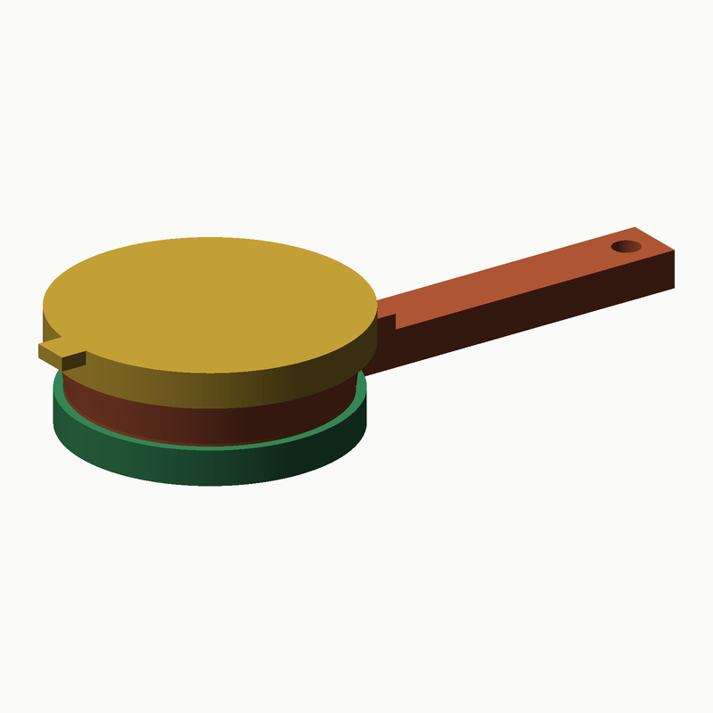
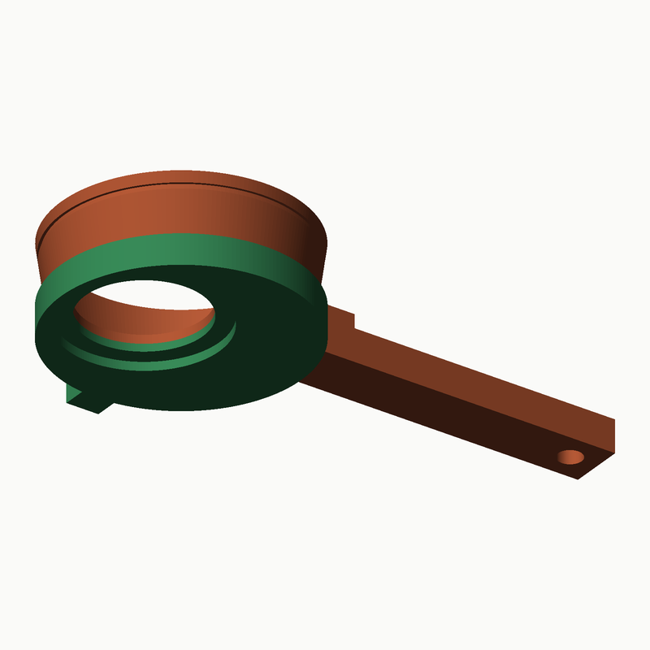
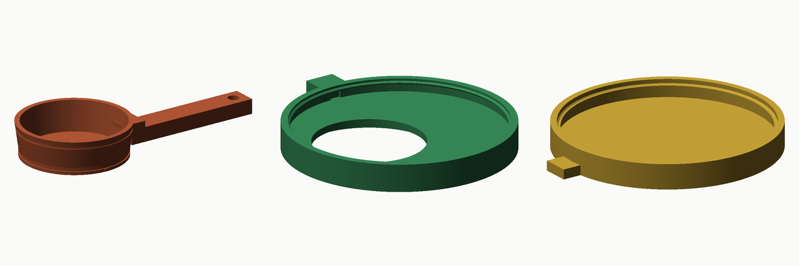

# Mini toz kepçesi — 15 mL / 30 mL

Üç parça, pim yok, O-ring yok, ray yok. Hepsi desteksiz basılır.

| Parça | Ne yapar |
|---|---|
| **Hazne** | Yuvarlak, Ø38 taban, 7° konik; 15 mL için 12,2 mm, 30 mL için 22,9 mm derin. Tabanında kenara yakın **Ø22 delik**. Tabandan uzanan 55 mm sap (asma delikli). |
| **Taban kapağı** (döner) | Haznenin altına alttan **klik** diye geçen 3 mm disk; aynı Ø22 delik ve altında şişe boynunun oturduğu Ø28,3 çukur. Kenarındaki kulağı **180° çevir**: delikler üst üste = **açık**, ters = **kapalı**. İki konumda da çentik (klik). İki boy için ortak. |
| **Üst kapak** | Ağza klik diye geçen düz kapak, kulaklı (saklama). |

**Kullanım:** üst kapağı çıkar → daldır, sıyır → kapağı tak. Dökerken: kepçeyi
şişe ağzına oturt (çukur boyna geçer), kulağı 180° çevir, hafifçe tıklat, geri çevir.

## Ölçülen

| | 15 mL | 30 mL |
|---|---|---|
| Taban kapağı 1°–180° dönerken hazneyle girişim (tümseksiz) | 0,000 mm³ | 0,000 mm³ |
| Çentik tümseklerinin eteğe binmesi (arada, esneme 0,2 mm) | 0,84 mm³ | 0,84 mm³ |
| Açık / kapalı konumda, üst kapak takılı | 0 / 0 / 0 | 0 / 0 / 0 |
| Silme hacim | 15,0000 mL | 30,0000 mL |

## Parçalar ve baskı

| Dosya | Baskı yönü |
|---|---|
| `01-hazne-15ml.stl` · `01-hazne-30ml.stl` | Taban tablada, ağız yukarı; sap tablada. Destek yok |
| `02-taban-kapagi.stl` | Düz alt yüzü tablada, etek yukarı. Ortak |
| `03-ust-kapak-15ml.stl` · `-30ml.stl` | Dış yüzü tablada, etek yukarı |

PETG · 0,16 mm · 3 duvar · %15 dolgu · destek kapalı. Ayrıntı: `BASKI-KILAVUZU.pdf`.
Kapak sıkıysa `FIT` 0,30 → 0,40; klik zayıfsa `DET` 0,35 → 0,45 (`cad/scoop_mini.py`).

## Montaj

1. Taban kapağını alttan, kulağı sapın soluna (90°) gelecek şekilde bastırın; etek klik yapar.
2. Kulağı ileri geri çevirip iki çentiği hissedin. Üst kapağı bastırın.
3. Temizlik: taban kapağını kulağından çekip çıkarın.

## Notlar

- Hacim ölçer, gram değil: 15 mL ≈ 5–8 g, 30 mL ≈ 10–17 g. Bir kez tartın.
- Taban deliği Ø22: protein tozu için yeterli, sıkışırsa tıklatın. Delik kenara
  yakın olduğu için dökerken kepçeyi delik tarafına hafif eğin.
- Taban kapağı ile hazne arası düz-düz temas; toz sızdırmaz ama sıvı için değil.
- FDM gıda sertifikasız; elde yıkayın.

`python3 cad/build_mini.py` → STL (`stl/toz-mini/`), rapor, görseller.
