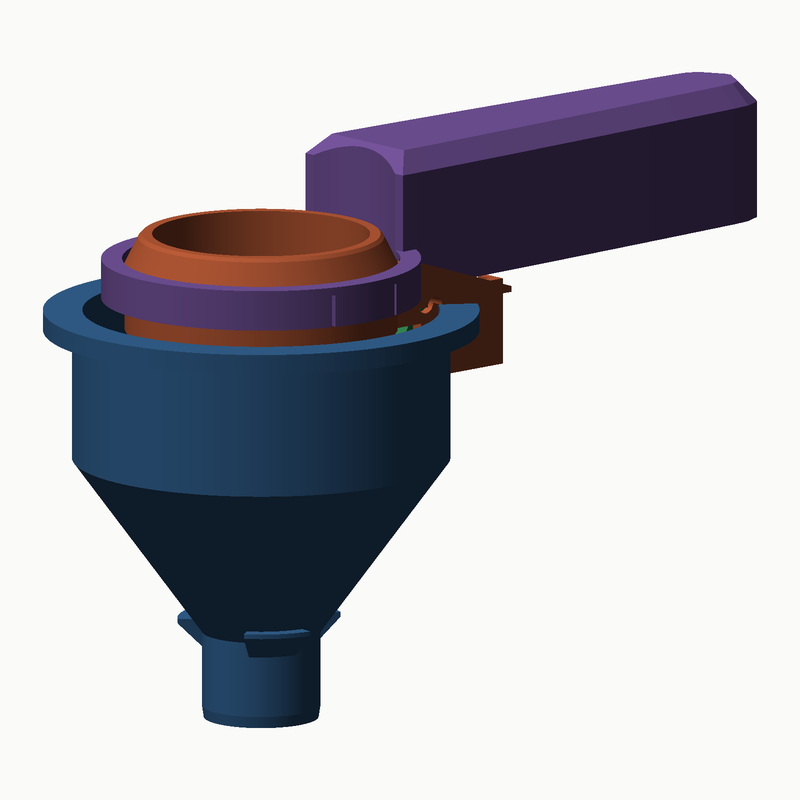
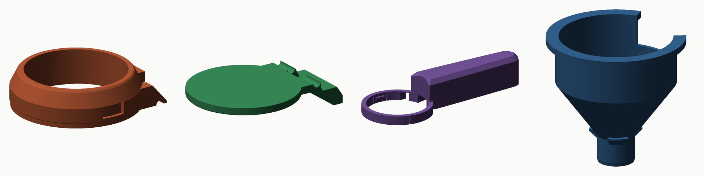

# Tabanı açılan toz ölçeği — 15 mL / 30 mL

Protein tozu ve pre-workout için. Kepçeyi **doğrudan pakete daldırıp** doldurursunuz,
fazlasını kabın kenarına sıyırıp silersiniz, şişenin üstünde tutup sapın altındaki
tetiği sıkarsınız: **kabın tabanının tamamı** aşağı açılır ve doz tek parça hâlinde
düşer.



**Kesit:** [15 mL](docs/toz-kesit-15ml.png) · [30 mL](docs/toz-kesit-30ml.png)
(solda kapalı, sağda tetik sıkılı)

---

## 1. Neden sıvı versiyonundaki mekanizma değil

Toz sıvı gibi davranmaz. Önceki tasarımı olduğu gibi kullanmak üç yerde kırılıyordu:

| Sıvı versiyonundaki çözüm | Tozda neden çalışmaz |
|---|---|
| Merkezi pistonlu valf, 1,2 mm halka boşluk | Halka boşluk toz için tıkanmanın tanımıdır |
| Ağzın üstünden geçen köprü | Silme ölçmeyi imkânsız kılar, pakete daldırmayı engeller |
| Altta 29 mm boru | Altında boru olan bir kepçe pakete daldırılamaz |
| Duvardaki ölçek çizgileri | Toz çizgiye kadar değil, **silme** ölçülür |

Bu yüzden toz ölçeği ayrı bir takım; sıvı versiyonu `stl/` altında duruyor.

## 2. Mekanizma

Kabın **tabanının tamamı** tek bir kapaktır. Menteşe ekseni sızdırmazlık
düzleminin **içinde** ve gözenek kenarının 2,7 mm dışındadır — bu iki koşul
birlikte, kapağın hiçbir noktasının dönerken oturma yüzeyine doğru yükselmemesini
sağlar. Kapağın kuyruğu menteşenin arkasından devam edip sapın altında **tetik
kaması** olur; kamayı yukarı sıkınca taban aşağı döner.

Ölçülen değerler (`docs/toz-olcegi-rapor.json`):

| | |
|---|---|
| Gözenek | **Ø38 mm**, hiçbir daralma yok |
| 65°'de gerçekten açık | **792 mm²** (gözeneğin %70'i) |
| Tetik stroku | 17,8 mm |
| Kapağın altta süpürdüğü derinlik | 42,5 mm |
| Çarpışma (tüm strok, her 2,5°) | **0,000 mm³** |

**Toz neden sıkışmaz.** Kemerlenme için iki şey gerekir: konsolide malzeme ve
kemere dayanak olacak **daralan duvar**. Bu kepçede toz sütunu 13–27 mm
(≈100–190 Pa) ve duvar hiç daralmıyor — tabanın tamamı yok oluyor. Sık alıntılanan
"15–25 mm minimum ağız" değeri konsolide malzeme için silo/huni geometrisinde
ölçülmüştür, buraya uygulanmaz. Akış yolundaki en dar kesit gözeneğin kendisidir.

**Tozun tutunmaması için** hazne 1° aşağı doğru genişler (taban ağızdan 0,5 mm
geniştir), böylece doz duvara sürtmeden çıkar; iç köşe yoktur.

## 3. Parçalar



| # | Dosya | Baskı yönü | Katı hacim |
|---|---|---|---|
| 1 | `stl/toz-olcegi/01-hazne-15ml.stl` · `-30ml.stl` | **Oturma yüzeyi tablada** | 7,9 / 14,4 cm³ |
| 2 | `stl/toz-olcegi/02-kapak-tetik.stl` | **Sızdırmaz yüz tablada** | 5,6 cm³ |
| 3 | `stl/toz-olcegi/03-sap.stl` | **Bilezik tablada** | 45,0 cm³ |
| 4 | `stl/toz-olcegi/04-huni-pet.stl` | **Ağız tablada** | 17,9 cm³ |
| 5 | `stl/toz-olcegi/05-mentese-mili.stl` | Dik | 0,3 cm³ |

**2, 3, 4 ve 5 iki boyda ortaktır.** 15 ↔ 30 mL geçmek için sadece hazneyi
değiştirirsiniz.

Sapın ayrı parça olması keyfî değil: 15 mL haznesi 13,4 mm derinliğinde ve
sızdırmazlık yüzeyi tablaya bakacak şekilde basılması gerekiyor (o yüzey birinci
katman kadar düz çıksın diye). Bu yönde ağzın üstüne çıkan hiçbir şey basılamaz —
yani sap gövdeyle birlikte basılamaz.

### Baskıya hazır olduğunun ölçüsü

Her parça kendi baskı yönünde taranıyor; desteksiz basılamayacak yüzey oranı:

| Parça | Sorunlu alan | Bunun köprü olan kısmı |
|---|---|---|
| Hazne | %2,4 | 74 mm² |
| Kapak | %4,4 | 154 mm² |
| Sap | %4,2 | 225 mm² |
| Huni | %0,8 | 175 mm² |

Kalan alanların neredeyse tamamı iki ucundan tutturulmuş kısa köprülerdir
(en büyüğü yay tablasının 6,5 mm'lik açıklığı). **Hiçbir parça destek istemez.**

## 4. Yay ve mil

Kapağı kapalı tutan yay **sapın içindeki bir ceptedir** ve kuyruğun üstündeki
yatay tablaya basar.

| | |
|---|---|
| Yay tipi | Sıradan **basma yayı** |
| Dış çap | ≤ 8,0 mm |
| Serbest boy | 30 mm (±3) |
| Montaj boyu | 24,8 mm |
| Tam açıkken | 15,4 mm |
| Uygun yay sabiti | 0,8 – 1,2 N/mm → tetikte ≈3 N'dan ≈9 N'a yükselen his |

Menteşe mili Ø3 mm. Baskılı mili kullanabilirsiniz; **3 mm paslanmaz çubuk veya
bir M3 vida** birebir geçer ve daha uzun ömürlüdür.

Yay bulamazsanız menteşe üzerinde bir **burulma yayı** için de yer bırakıldı
(bobin Ø5 × 5 mm, mil üzerinde, üst bacağı gövdedeki köprüye dayanır) — bir
mandal yayı bu ölçüye yakındır.

## 5. Baskı ayarları (Bambu Lab X1C)

| Ayar | Değer | Neden |
|---|---|---|
| Malzeme | **PETG** | Toz + nem + yıkama; PLA kırılganlaşır |
| Katman | 0,16 mm (hazne, kapak) · 0,2 mm (sap, huni) | Sızdırmazlık yüzeyi ne kadar düz olursa o kadar az toz eler |
| Duvar | 4 | |
| Dolgu | %15 gyroid | Sap için %10 yeter, büyük parça |
| Destek | **Kapalı** | |
| Brim | Hazne ve kapak için açık | Tabana temas alanları küçük |
| Ironing | Haznenin **üst** yüzeyleri açık | Ağız kenarı silme için düz olsun |

Huninin en üst kısmı (baskıda boru ucu) ince bir halkadır: **minimum katman
süresini 8–10 s** yapın veya iki huni birden basın, yoksa boğaz sarkar.

## 6. Montaj

1. Kapağı gövdenin altından yerine tutun, bogumlarla gövdenin yanakları
   hizalansın.
2. **Mili** yandan itip geçirin. Kapak artık serbestçe dönüyor olmalı.
3. **Yayı** sapın içindeki cebe düşürün.
4. Sapı gövdenin üstünden geçirip aşağı bastırın; iki tırnak **"klik"** diye
   yuvalarına oturur. Yay kuyruğun tablasına oturmuş olur.
5. Tetiği birkaç kez sıkıp bırakın.

Sökme tersi: sapın bileziğini iki yandan hafifçe açıp yukarı çekin, mili itip
çıkarın. Beş parça da elde yıkanır.

## 7. Kullanım

1. **Daldır.** Kapak kapalı. Kabı toza dik indirin, ağız toz yüzeyinin 8–12 mm
   altına insin. Parmaklarınız tozun üstünde kalır.
2. **Silme.** Paketin ağız kenarını kabın **uzak** tarafına koyup **saptan uzağa**
   doğru çekin. Tek geçiş. Sap tarafına doğru sıyırmayın, kavrama yolda.
3. **Boşalt.**
   - **30 mL / protein → shaker'a, hunisiz.** Kabın flanşını shaker'ın ağzına
     dayayın. Shaker ağzı zaten 55 mm+; hiç daralma yok, en güvenli yol budur.
   - **15 mL / pre-workout → pet şişeye, huniyle.** Huniyi şişenin ağzına
     oturtun, kepçeyi huninin bileziğine bırakın, tetiği sıkın.
4. Bırakın; yay tabanı geri oturtur.

**Toz yerleşsin diye kabı tıklatmayın.** Tıklatmak yığın yoğunluğunu %10–15
değiştirir; doz bozulur. Sadece silin.

## 8. Dürüst olmam gereken yerler

- **Gram hassasiyeti.** Bu bir **hacim** ölçeğidir ve hacmi ±%2 tekrarlar. Ama
  protein tozunun yığın yoğunluğu 0,35–0,65 g/mL arasında değişir ve aynı tozun
  kabarık hâli ile dibe oturmuş hâli arasında %10–15 fark vardır. Yani
  **15 mL ≈ 5–8 g, 30 mL ≈ 10–17 g** ve hiçbir hacimsel kepçe bunu düzeltemez.
  Bir kez mutfak terazisinde tartın, o sayıyı aklınızda tutun.
- **Pet şişe gerçeği.** 21,7 mm'lik bir şişe boynundan 30 mL tozu geçirmek
  gerçekten zordur — huninin boğazı, kepçenin aksine daralan bir geometridir ve
  asıl tıkanma riski oradadır. Bu yüzden huni **15 mL dozu için** ölçülendirildi;
  30 mL için geniş ağızlı shaker kullanın. İllâ pet şişeyse 15 mL'lik iki doz
  atın.
- **Huni boyu.** Huni 71,5 mm. Tek kanatlı tam açılan bir kapağın altta 42,5 mm
  süpürmesinin doğrudan sonucu. Huninin iç profili bu süpürme zarfından
  türetildi, yani bu **mümkün olan en kısa** huni.
- **Sızma.** Kapalı kapak düz yüzey teması yapar, conta yoktur. Taşırken bir
  miktar ince toz elenebilir. Sızdırmazlık yüzeyini 600–1000 kum zımparayla
  hafifçe düzlemek belirgin fark eder.
- **Gıda teması.** FDM parçalarının katman aralarına bakteri yerleşir; bu tasarım
  gıda için sertifikalı değildir. Kuru toz için ve sık yıkanmak kaydıyla makul,
  ama bunu bilerek kullanın. **Bulaşık makinesine koymayın** — PETG'nin cam
  geçişi ~80 °C, alt sepet bunu aşar. Elde, ılık suyla yıkayın ve **tamamen
  kurutun**; ıslak kalırsa toz kekleşir.

## 9. Modeli değiştirme

```bash
pip install trimesh manifold3d numpy shapely matplotlib pillow rtree networkx
python3 cad/build_scoop.py        # STL + rapor + görseller
```

Parametreler `cad/scoop.py` başındaki `P` sözlüğünde. Yeni bir boy için
`SIZES`'a ekleyin; hazne derinliği silme hacimden çözülür.

**Bu depo iddia etmez, ölçer.** `cad/build_scoop.py` her üretimde şunları
ölçüp `docs/toz-olcegi-rapor.json`'a yazar:

- her parçanın kapalı (watertight) katı olduğunu,
- kapağın **tüm stroku boyunca** gövdeye, sapa ve huniye çarpmadığını
  (her 2,5°'de, iki boy için),
- gözeneğin açıya göre **gerçekten** ne kadar açıldığını (mesh gölgesi
  izdüşümüyle),
- her parçanın kendi baskı yönünde desteksiz basılabilirliğini,
- silme hacmin hedefi tutturduğunu.

| Dosya | İçerik |
|---|---|
| `cad/scoop.py` | Parametreler ve parça tanımları |
| `cad/kinematics.py` | Hareket, çarpışma, açıklık ve çıkıntı ölçümleri |
| `cad/section_scoop.py` | Kesit çizimi (meshten birebir) |
| `cad/build_scoop.py` | Hepsini üretir ve doğrular |
