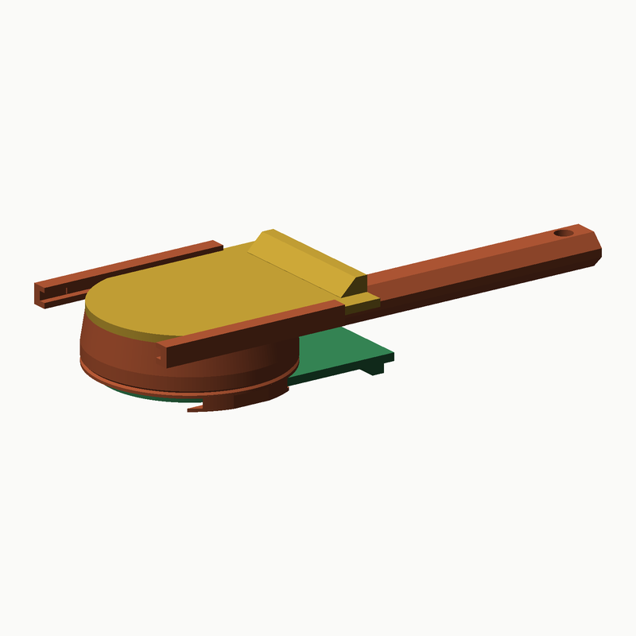
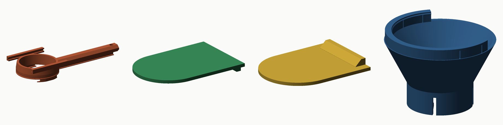

# Sade sürmeli kepçe — 15 mL / 30 mL

Normal bir kepçe: hazne + ince sap. Altında ve üstünde **sürmeli kapak**, ikisi de
kapanınca **çentiğe** oturur, çantada açılmaz. Şişirilmiş hiçbir şey yok.

**Nasıl kullanılır:** üst kapağı geri çek → pakete daldır → üst kapağı ileri it:
ön kenarı fazla tozu **süpürür**, silme yerine geçer, klik → çantaya. Şişenin
üstünde alt plakayı geri çek: taban açılır, toz düşer. Klik.

---

## 1. Mekanizma

| | |
|---|---|
| **Alt plaka** | Tabanın kendisi. Flanşın altındaki iki C kanalda 34 mm geri kayar; gözeneğin **%92**'si açılır. Kapanırken son 8 mm'de kama O-ring'e sıkar (Ø38 × 1,5, standart). Arkada aşağı dönük 4 mm parmak tırnağı. |
| **Üst kapak** | Ağız hizasında iki C rayda kayar; alt yüzü tam ağız düzleminde (z = h). Kapanırken tozu süpürür → doz = kapağın altında kalan hacim, tam silme. Arkada yukarı dönük tırnak. |
| **Çentik** | Her iki kapağın kenarında oyuk, ray/kanal duvarında 0,45 mm tümsek. Kapalı konumda klik; PETG'de yüzlerce kez çalışır. |
| **Sap** | Tek parça, altıgen kesit 12 × 8 mm, 88 mm, ucunda asma deliği. Kabın altındaki plakanın üstünde, üstündeki kapağın altında. |

Kapaklar sapa doğru kayar; üst kapak açıkken sapın üstünde durur (sap 8 mm, kapak
ağız hizasında — 15 mL'de 3 mm boşluk).

| Ölçülen | 15 mL | 30 mL |
|---|---|---|
| Alt plaka stroku boyunca çarpışma (her 1 mm; gövde, kapak, huni) | 0,000 mm³ | 0,000 mm³ |
| Üst kapak stroku (tam açılma) | 50 mm, 0,000 mm³ | 52 mm, 0,000 mm³ |
| Silme hacim | 15,0000 mL / 12,2 mm | 30,0000 mL / 22,9 mm |

## 2. Parçalar

| # | Dosya | Baskı yönü |
|---|---|---|
| 1 | `01-hazne-15ml.stl` · `01-hazne-30ml.stl` | **Ağız yukarı** (kanal dudakları tablada), brim |
| 2 | `02-alt-plaka.stl` | Conta yüzü tablada — ortak |
| 3 | `03-ust-kapak-15ml.stl` · `03-ust-kapak-30ml.stl` | Alt yüz tablada |
| 4 | `04-huni-pet-vidali.stl` | Opsiyonel: şişeye vidalanan huni (15 mL / pet için) |
| 5 | `05-conta-tpu.stl` | Opsiyonel: O-ring yoksa TPU 95A |

Alt plaka iki boyda ortak. Hazne ve üst kapak boya özel.

**Sapın altındaki payanda.** Hazne ağız yukarı basılır; sap tabladan 3,5 mm
yukarıda başlar. O yüzden sapın altına 0,8 mm'lik ince bir payanda modele
eklendi (üstünde 0,25 mm boşluk). **Baskıdan sonra elle kırıp atın** — alt plaka
oradan geçer. Başka destek gerekmez; kapak ve plaka sıfır çıkıntıyla basılır.

## 3. Baskı (Bambu X1C, PETG)

Katman 0,16 mm (hazne, plaka, kapak) · duvar 4 · dolgu %15 · destek **kapalı** ·
brim hazne için açık · ironing haznenin üst yüzeylerinde (rayların oturma
çıkıntısı). Sürgüler sıkı gelirse `FIT` 0,30 → 0,40.

## 4. Montaj

1. Payandayı kırın. O-ring'i flanşın altındaki yuvaya bastırın.
2. Alt plakayı arkadan kanallara sokup öne itin; klik + son 8 mm'de O-ring
   direnci.
3. Üst kapağı arkadan raylara sokup öne itin; klik.

Sökmek: kapağı/plakayı geriye çekip alın. Yıkayın, **tamamen kurutun**.

## 5. Dürüst notlar

- **Gram değil hacim.** ±%2 hacim; gram tozun yoğunluğuna göre 15 mL ≈ 5–8 g,
  30 mL ≈ 10–17 g. Bir kez tartın.
- **Tozu tıklatmayın.** Yığın yoğunluğu %10–15 değişir; kapağı it, süpürsün.
- **Alt plakanın tırnağı** 4 mm aşağı sarkar; kepçe masada hafif eğik durur.
- **Kanallara toz** girer, aşağı açık, dökülür; O-ring'in dışında kalır.
- **Gıda teması**: FDM, sertifikasız. Elde yıkayın, bulaşık makinesine koymayın.

## 6. Model

`python3 cad/build_slim.py` — STL, `docs/toz-sade-rapor.json` ve görseller.
Parametreler `cad/scoop_slim.py` (`P`); kanal/O-ring/huni `cad/scoop_slide.py`'den
miras alınır.
