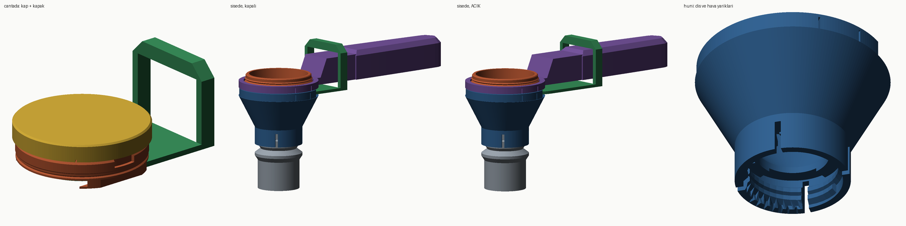
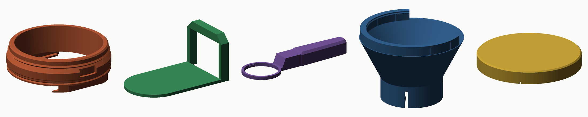

# Sürgülü toz doz kabı — 15 mL / 30 mL

**Doldur → kapağını kapat → çantaya at → salonda şişeye vidala → sürgüyü it.**

Gösterdiğiniz ürünün mantığı: kap kapalı bir kova, altında tek bir plaka, plaka
sapa doğru kayınca taban açılır. Aşağı sarkan hiçbir şey yok — kutu yok, yay yok,
mil yok. Üstüne saklama kapağı, altına pet şişeye **vidalanan** huni eklendi.



Soldan sağa: çantada (kap + üst kapak), şişeye vidalı ve kapalı, şişede açık,
huninin dişi ve hava yarıkları.

Kaldırılan menteşeli versiyon `stl/toz-olcegi/` altında duruyor; bu klasör
(`stl/toz-surgulu/`) yenisidir ve **önerilen budur**.

---

## 1. Nasıl çalışır

- **Plaka tabanın kendisidir.** Kap alttan açık bir kovadır; plaka kovanın altında,
  iki yandaki C kanallarda kayar. Kapalıyken plakanın üst yüzü kabın tabanıdır
  (z = 0, hacim datumu).
- **Başparmakla it.** Plakanın arkasındaki bar sapın boynunun altından geçer; iki
  yandan yükselen üzengi sapın üstünde birleşir. Üzengiyi sapa doğru itince plaka
  26 mm geri kayar, gözenek açılır, toz düşer. Geri çekince kapanır.
- **Kama kilidi.** Kanal dudakları öne doğru 0,35 mm yükselir: plaka kapanırken
  son 7 mm'de oturma yüzeyine sıkışır. Taşırken toz elenmez, sürgü kendiliğinden
  açılmaz.
- **Yay yok.** İki yönlü başparmak hareketi. Unutursanız toz akar, hemen fark
  edersiniz.

| Ölçülen | |
|---|---|
| Gözenek | Ø38, tabanda hiçbir daralma yok |
| 26 mm sürgüde gerçekten açık | **892 mm²** (%79) — menteşeli versiyondan daha fazla |
| Sürgü çarpışması (0–26 mm, her 1 mm, iki boy, sap ve huni dahil) | **0,000 mm³** |
| Kepçenin altında sarkan | 3,1 mm (kanal dudakları); hepsi düz |
| Silme hacim | 15,0000 / 30,0000 mL |

## 2. Daldırınca ne olur

Tozla temas eden alt yüzey: plakanın düz altı + iki kanal dudağının düz altı, hepsi
aynı düzlemde. Aradaki 0,3 mm'lik boşluk aşağı açık; kaldırınca ne girdiyse düşer.
Sapın altında cep yok. Kabın dış yüzeyi 7° konik ve pürüzsüz.

Plaka geri kayarken üstündeki tozu kabın arka kenarına sürter; bir kısmı barın
üstünde dışarı çıkar ve **kabın arkasında, sapın altında** yere düşer (gösterdiğiniz
üründe de böyledir). Bu yüzden boşaltırken kepçeyi huninin/şişenin üstünde tutun,
masanın değil.

## 3. Parçalar



| # | Dosya | Baskı yönü |
|---|---|---|
| 1 | `01-hazne-15ml.stl` · `01-hazne-30ml.stl` | **Ağız tablada** |
| 2 | `02-surgu.stl` | **Plaka tablada** |
| 3 | `03-sap.stl` | **Bilezik tablada** |
| 4 | `04-huni-pet-vidali.stl` | **Ağız tablada** — PCO-1881 dişli, şişeye vidalanır |
| 5 | `05-ust-kapak-15ml.stl` · `05-ust-kapak-30ml.stl` | **Tepe tablada** |

2, 3 ve 4 iki boyda ortaktır. Hazne ve üst kapak boya özeldir (ağız çapları
farklı: 41 / 43,6 mm).

### Üst kapak

Ağzın 3 mm altındaki boncuğa klik yapar; altındaki 1,8 mm'lik halka kabın içine
girip toz sızdırmazlığı sağlar. Dört esneme yarığı var, tırnakla açılır. Çantada
sürgü kapalı ve kama kilitli, üstte kapak: iki uç da kapalı.

### Şişeye vidalanan huni

Alt kısmı standart 28 mm pet şişe kapağı gibi **PCO-1881 / PCO-1810** dişlidir
(hatve 2,7 mm, 1,6 tur). Şişeye tam vidalanır; artık sallanmaz, düşmez. Şişe ağzı
huninin tavanındaki üç pede yaslanır, aralarından ve etekteki dört yarıktan hava
kaçar — şişe içindeki hava tozla ters yönde boğazdan geçmek zorunda kalmaz.

Huninin ağzındaki bilezik kabın flanşını dıştan sarar ve flanştaki V yuvaya klik
yapar (4 esneme yarığı). Sap tarafında bilezik açıktır; plaka ve üzengi oradan
geçer. Kap huniye oturunca **elinizi çekebilirsiniz**: şişe–huni–kap tek parça
gibi durur, sürgüyü tek elle itersiniz.

Diş: sise dış crest Ø27,43 için etek iç Ø28,6 (0,6 mm boşluk), diş sırtı Ø25,9
(kök Ø24,94'e 0,5 mm geçme). İlk baskıda sıkı gelirse `THR_CREST_D`'yi 26,2 yapın.

**Hiçbir parça destek istemez.** İki dikkat: sürgünün üzengi çatısı iki kol
arasında **33 mm'lik bir köprüdür** (köprü ayarları açık; alt yüzü sarkarsa
görünmez), huninin iç dişi 45° flanklıdır ve basılı şişe kapaklarındaki gibi
desteksiz çıkar.

Hazne **ağzı tablada** basılır: silme kenarı birinci katman kadar keskin, oturma
yüzeyi ütülenebilir üst yüzey olur; kanallar baskıda yukarı büyür.

## 4. Baskı ayarları (Bambu Lab X1C)

| Ayar | Değer |
|---|---|
| Malzeme | PETG |
| Katman | 0,16 mm (hazne, sürgü) · 0,2 mm (sap, huni) |
| Duvar | 4 |
| Dolgu | %15 gyroid |
| Destek | Kapalı |
| Brim | Hazne için açık (ağız halkası dar) |
| Köprü | Sürgü için köprü hızı düşük, fan tam |
| Ironing | Haznenin üst yüzeyleri (oturma bileziği) |

Plaka ile kanal arasında 0,3 mm çapsal boşluk var. İlk baskıda sürgü sıkı gelirse
`P["FIT"]`'i 0,40 yapın; bol gelirse 0,25.

## 5. Montaj

1. Sürgüyü kabın arkasından, kanalların altından sokup öne kadar itin. Son
   7 mm'de kama sıkışmasını hissedersiniz.
2. Sapı kabın üstünden geçirip bastırın; iki tırnak yuvalarına oturur. Sapın boynu
   üzenginin iki kolu arasından geçer.
3. Üzengiyi ileri-geri kaydırıp bakın: 26 mm serbest hareket.

Sökmek için sapı çıkarın, sürgüyü arkaya doğru çekip alın. Üç parça da elde
yıkanır; kanalları parmakla/fırçayla temizleyin.

## 6. Kullanım

**Evde:**
1. Sürgü kapalı (üzengi kaba yakın). Kabı toza dik daldırın, ağız 8–12 mm
   toz altına insin.
2. Kaldırıp paketin kenarıyla **saptan uzağa** doğru silin.
3. Üst kapağı takın. İsterseniz sapı çıkarın (bilezik iki yandan hafif açılır).
   Çantaya.

**Salonda:**
4. Huniyi pet şişeye vidalayın. Kabı huninin bileziğine bastırın — klik.
5. Üst kapağı alın. Başparmakla üzengiyi sapa doğru itin; toz şişeye iner.
   Geri çekin, kabı çekip alın.

**30 mL / protein** için huni gerekmez: shaker ağzı 55 mm+; kabın flanşını ağza
dayayıp itin. 15 mL / pre-workout pet şişeye huniyle gider.

Tozu yerleştirmek için kabı tıklatmayın — yığın yoğunluğu %10–15 değişir.

## 7. Dürüst notlar

- **Gram değil hacim.** Hacim ±%2; gram, tozun yoğunluğuna göre 15 mL ≈ 5–8 g,
  30 mL ≈ 10–17 g. Bir kez tartın.
- **Arkaya toz.** Sürgü açılırken bir tutam toz kabın arkasından düşer. Ürünün
  yapısal özelliği; menteşeli versiyonda yoktu, karşılığında altta 13 mm'lik kutu
  vardı. Sizin tercihiniz buydu ve bence doğru tercih.
- **Kanallara toz.** Plaka kanallarda kaydığı için toz girer; kanallar arkaya açık,
  çoğu dökülür. Haftada bir fırçalayın.
- **Çantada üzengi.** Sap sökülse de üzengi plakaya bağlı olduğu için kabın
  üstünde 30 mm dik durur; kap çantada yassı bir puk değil, üzengili bir puk.
  Katlanır üzengi mümkün ama bir menteşe daha demek; istemedim.
- **Diş toleransı.** Pet şişe boyunları markadan markaya 0,2–0,3 mm oynar.
  Basılı diş ilk denemede sıkı ya da bol gelebilir; `THR_CREST_D` ile ayarlanır.
- **Gıda teması.** FDM parçası, sertifikalı değil. Elde yıkayın, tamamen kurutun,
  bulaşık makinesine koymayın (PETG ~80 °C'de yumuşar).

## 8. Modeli değiştirme

```bash
python3 cad/build_slide.py     # STL + docs/toz-surgulu-rapor.json + görseller
```

Parametreler `cad/scoop_slide.py` başındaki `P` sözlüğünde. Her üretimde
sürgünün tüm stroku boyunca çarpışma, gözeneğin gerçek açıklığı, baskı yönünde
desteksizlik ve silme hacim ölçülüp rapora yazılır.
