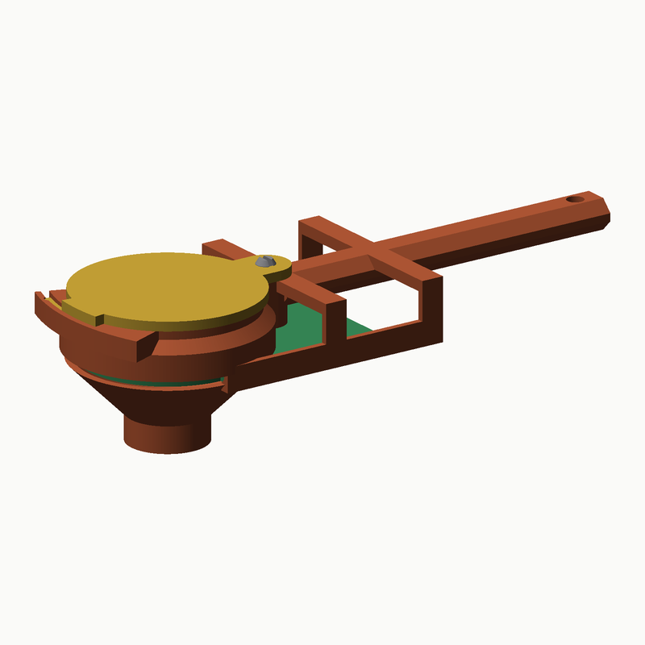
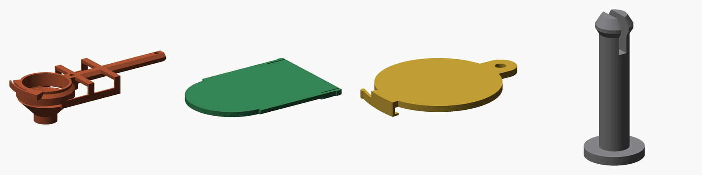

# Yuvarlak kepçe, sürgülü taban — 15 mL / 30 mL

Hazne yuvarlak, üst kapak yuvarlak disk; taban ise **sapa doğru kayan bir
plaka**. Tek elle: sapı tutan elin işaret parmağı, sapın kökünün altındaki
tırtıklı **tetik çubuğunu** avuca doğru çeker → taban açılır, toz alttaki
huniden şişeye akar → çubuk ileri itilir → klik. Haznenin altı hafif huni, ucu
PET şişe ağzına (PCO-1881) girer.

**Kullanım:** üst diski sapın üstüne doğru çevir (120°) → daldır → diski geri
çevir: ön kenarı fazla tozu **süpürür**, son 14°'de burundaki kanala girip klik.
Huniyi şişe ağzına oturt → tetiği çek (42 mm, sonunda klik = açık konum) →
toz düşer → tetiği ileri it, klik.

---

## 1. Mekanizma

| | |
|---|---|
| **Taban plakası** | 2,5 mm; önü r 22 yuvarlak, arkası 48 mm geniş düz kenarlı, 68 mm uzun. Kapalıyken O-ring'i (Ø38 × 1,5, yuvadan 0,35 taşar) 0,25 mm sıkar. Sapa doğru **42 mm** kayınca hazne tamamen açık (ön kenar x = +20, hazne kenarı 19). Arkadan tamamen çıkarılabilir (temizlik). |
| **Raylar** | Sapın kökünde iki **alçak ray** (6,5 mm yüksek, 1,6 mm dış duvar), altlarında **dudaklar**: ilk 33 mm'de 45° eğimli — plakanın pahlı kenarı oturur, kızak gibi kendini ortalar; sonrası düz. O-ring plakayı dudaklara bastırır → conta **kenar boyunca eşit** sıkışır. Rayları sapa bağlayan iki ince **köprü** (x 28 ve 56; bacaklar + ağız düzleminde çubuk). Ters baskıda rayın üst kenarı köprü bacakları arasında 19/22 mm köprülenir. |
| **Plaka kilidi** | Plakanın iki arka kenarına kesilmiş **yay parmakları** (1,6 mm şerit, 10 mm, önden bağlı), dış yüzlerinde 0,5 mm'lik 45° yanaklı tümsek. Rayın iç yüzünde iki çift yuva: **kapalı** ve **açık** konumda tümsek yuvaya oturur → klik. Arada parmak 0,35 mm içe esner (~2 N/parmak). Sallanma torkunun >10 katı. |
| **Tetik** | Plakanın altında, sapın kökünün altında 32 mm'lik tırtıklı çubuk (4 mm sarkar). Sapı tutan elin işaret parmağı çeker (açar) / iter (kapar). Başka çıkıntı yok. |
| **Üst disk** | Ø(ağız + 2,4), 2,5 mm. Sapın kökündeki Ø4 mil etrafında +y'ye 120° döner. Ön kenarından 3,4 mm sarkan **bacak** + içe bakan **ayak**: kapanmanın son 14°'sinde burundaki dudağın altına girer, dudağın altı rampalı (0,4) → kapak ağza çekilir. Bacağın yanındaki 10 mm **yay parmağı** + 0,6 mm tümsek kanal duvarındaki yuvaya oturur → klik. |
| **Burun** | Gövdenin önünde, ağızdan 5,4 mm aşağı; pivot merkezli (±22°). Üst kapağın kanalı buna oyulu; dış yüzü dönüş eksenine eşmerkezli. |
| **Mil** | Ø4; alttan sürülür, başı gövdenin altındaki havsaya gömülür (plaka başın altından geçer → mil düşmez), yarıklı ucu üst diskin üstüne klik yapar. |
| **Huni** | Gövdeyle tek parça: üst halkası plakanın 0,1 mm altında (plakayı taşır), 45° koni Ø20,8 × 7 mm boruya iner (PCO-1881 iç çap 21,74 → yanda 0,47 mm hava yolu). |
| **Sap** | Altıgen 12 × 8 mm, 86 mm, asma delikli; üst yüzü ağız düzleminde. |

| Ölçülen (1° / 0,5 mm adım) | 15 mL | 30 mL |
|---|---|---|
| Plaka 0 → 50 mm kayarken gövdeyle girişim (tümseksiz gövde) | 0,000 mm³ | 0,000 mm³ |
| Üst kapak 1°–120° gövdeyle girişim (tümseksiz) | 0,000 mm³ | 0,000 mm³ |
| Açık plaka – dönen üst kapak | 0,000 mm³ | 0,000 mm³ |
| Plaka tümseklerinin raya binmesi (yuvalar arası, esneme) | 3,88 mm³ | 3,88 mm³ |
| Kapak tümseğinin kanal duvarına binmesi (ilk 10°) | 2,09 mm³ | 2,09 mm³ |
| Kapalı ve açık konumda (tümsekler yuvada) | 0 | 0 |
| Silme hacim | 15,0000 mL / 12,2 mm | 30,0000 mL / 22,9 mm |

## 2. Parçalar

| # | Dosya | Baskı yönü |
|---|---|---|
| 1 | `01-hazne-15ml.stl` · `01-hazne-30ml.stl` | **Ağız tablada (ters), huni yukarı.** Köprü bacakları tabladan yükselir, dudaklar ve koni 45°. Destek yok |
| 2 | `02-alt-plaka.stl` | **Conta yüzü tablada**, tetik yukarı. Ortak (iki boy için aynı) |
| 3 | `03-ust-disk-15ml.stl` · `-30ml.stl` | Üst yüz tablada; bacak, ayak, parmak yukarı. Ayağın 1,8 mm'lik çıkıntısı desteksiz |
| 4 | `04-mil-15ml.stl` · `-30ml.stl` | Baş tablada |
| 5 | `05-conta-tpu.stl` | Opsiyonel: O-ring yoksa TPU 95A |

Hazne yüksekliği 15 mL için 36 mm, 30 mL için 47 mm. Raporda hazne için
görünen %2,5–4,5 "çıkıntı" tam 45°'lik dudak/koni yüzeylerinin sınırda
sayılmasıdır; 45°'den dik yüzey yok, köprü 575 mm² (ray üst kenarları 19/22 mm,
dudak altları, kanal tabanları, huni halkasının 2 mm kenarı) — X1C'de destek
istemez. Ayrıntılı baskı belgesi: `BASKI-KILAVUZU.pdf`.

## 3. Baskı (Bambu X1C, PETG)

Katman 0,16 mm · duvar 4 · dolgu %15 · destek kapalı · brim hazne için açık.
Plaka sıkı kayıyorsa `FIT` 0,30 → 0,40; klik çok sertse `PBUMP` 0,5 → 0,4
(kapak için `BUMP` 0,6 → 0,45); gevşekse `PFING_T` 1,6 → 2,0.

## 4. Montaj

1. O-ring'i oturma yüzeyindeki yuvaya bastırın.
2. Mili alttan gövdenin göbeğine sürün, üst diski takın; yarıklı uç diskin
   üstünde klik yapar.
3. Plakayı arkadan, tetik aşağıda, raylara sürün: pahlı kenarlar dudaklara
   oturur; ilk klik açık konum, ikincisi kapalı. Plaka mil başını da kapatır.
4. Sökmek: plakayı arkadan çekip çıkarın; mil ucunu iki yandan sıkıp geri itin.

## 5. Dürüst notlar

- **Gram değil hacim**: ±%2 hacim; 15 mL ≈ 5–8 g, 30 mL ≈ 10–17 g. Bir kez tartın.
- **Şekil**: sapın kökündeki iki alçak ray + iki köprü, sürgülü taban için
  gereken rayın ters baskıda desteksiz basılabilen biçimi. Hazne ve kapak
  yuvarlak; raylar 6,5 mm, köprüler 6 × 1,6 mm.
- **O-ring** plaka her açılışta üzerinden kayar; yılda bir değiştirin.
  **Tıklatmayın**, süpürün. FDM, gıda sertifikasız; elde yıkayın.
- **Huni**: koni + boru hazneyi 21 mm aşağı uzatır; pakete daldırırken önce
  boru girer, hazneyi dibe bastırmayın. Shaker'a dökerken boru ağızdan geçer.

## 6. Model

`python3 cad/build_round.py` — STL, `docs/toz-yuvarlak-rapor.json`, görseller.
Parametreler `cad/scoop_round.py` (`P`). Plaka kayması, kapak dönüşü, tümsek
girişimleri ve baskı çıkıntıları her üretimde ölçülür.
